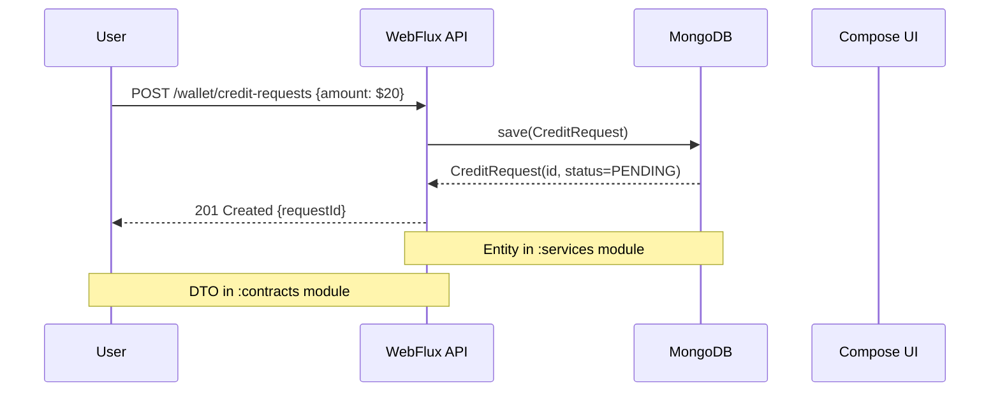

<workflow>

<critical>Communicate in {communication_language} throughout the workflow</critical>

# Pre-Refinement Workflow Instructions

**Purpose:** Interactive epic-based pre-refinement with Product Owner participation to prepare tickets for backlog refinement

---

## State File Management

**State Folder**: `.bmad/state/pre-refinement-{session_id}/`

<action>
**At workflow start, create state folder and initialize state.json**:

```bash
# Generate session ID (timestamp-based)
SESSION_ID=$(date +%Y%m%d-%H%M%S)
STATE_DIR=".bmad/state/pre-refinement-${SESSION_ID}"

# Create state folder
mkdir -p "${STATE_DIR}"

# Initialize state.json
cat > "${STATE_DIR}/state.json" << 'EOF'
{
  "workflow": "pre-refinement",
  "session_id": "${SESSION_ID}",
  "started_at": "$(date -Iseconds)",
  "status": "in_progress",
  "input_type": null,
  "epic_key": null,
  "selected_tickets": [],
  "refined_tickets": [],
  "current_ticket_index": 0,
  "cache_dir": "${STATE_DIR}"
}
EOF
```

Store `{state_dir}` = "${STATE_DIR}" for use throughout workflow.
Store `{state_file}` = "${STATE_DIR}/state.json" for recovery.
</action>

## Recovery Protocol

<check if="state_file_exists">
  <action>
  **Recovery from previous session**:

1. Scan `.bmad/state/pre-refinement-*/state.json` for sessions with `status: "in_progress"`
2. Load most recent state file → Parse JSON
3. Verify pre-refined tickets in Jira → Compare with `refined_tickets` array
4. Prompt user: "Found incomplete session from {started_at}. Resume? (yes/no)"
5. If yes → Set `{state_dir}` and `{state_file}` from recovered session
6. If no → Create new session (run State File Management above)
   </action>
   </check>

---

<step n="0" goal="Initialize Story Type Tracking">

<action>Communicate in {communication_language} with {user_name}</action>

**Purpose**: Initialize story type tracking system for routing stories to appropriate coordination workflows.

<action>
**Initialize Story Types Dictionary**:
- Create empty dictionary: {story_types} = {}
- This will store story type for each ticket (backend/frontend/full-stack)
- Populated during ticket selection (Step 2 or Step 2.4)
</action>

<template-output section="story_type_system_initialized">
## 📊 Story Type System Initialized

Story type tracking is now active. Each ticket will be classified as:

- **Backend** (BE label only)
- **Frontend** (UI/Shared/Platform labels only)
- **Full-Stack** (BE + UI/Shared/Platform labels)

This enables strategic coordination for full-stack stories.
</template-output>

</step>

---

<step n="1" goal="Determine Input Type">

<action>Communicate in {communication_language} with {user_name}</action>

<ask>Input type: Epic-based or Manual ticket selection? (epic/manual):</ask>

<action>Store in {input_type}</action>

<action>
**Update state.json**:
```bash
jq '.input_type = $type' --arg type "{input_type}" \
  "{state_file}" > "{state_file}.tmp" && mv "{state_file}.tmp" "{state_file}"
```
</action>

</step>

---

<step n="2A" goal="Epic-Based Flow (if input_type == epic)">

<action>Communicate in {communication_language} with {user_name}</action>

### 2A.1: Get Epic Key

<ask>Enter Epic key (e.g., ESNG-10):</ask>

<action>Store in {epic_key}</action>

### 2A.2: Fetch Epic from Jira

<action>
**BMad-Master delegates to jira-manager**: Fetch epic details

**Agent**: jira-manager (`~/.claude/agents/jira-manager.md`)

**Operation**: getJiraIssue

**Parameters**:

- cloudId: "{jira_cloud_id}"
- issueIdOrKey: "{epic_key}"

**Expected Return**: Epic summary, description, status, labels, priority

Store results in: {epic_summary}, {epic_description}, {epic_status}
</action>

### 2A.3: Smart Confluence Fetching

<action>
Parse {epic_description} for Confluence links (URLs containing `/wiki/spaces/` or `/wiki/pages/`)

If Confluence links found → Extract page IDs → Store in {confluence_links}
</action>

<check if="confluence_links.length > 0">
  <action>
  **BMad-Master delegates to confluence-manager**: Auto-fetch Confluence pages

**Agent**: confluence-manager (BMad built-in)

**Operation**: getConfluencePage (for each link)

**Parameters**:

- cloudId: "{jira_cloud_id}"
- pageId: "{extracted_page_id}"

**Expected Return**: Page content in Markdown format

Store results in: {confluence_docs}
</action>
</check>

<check if="confluence_links.length == 0">
  <ask>No Confluence links found in epic. Please provide Confluence page URL for this epic (or press Enter to skip):</ask>

  <check if="user_provided_link">
    <action>
    Extract page ID from user-provided URL

    **BMad-Master delegates to confluence-manager**: Fetch page

    **Agent**: confluence-manager (BMad built-in)

    **Operation**: getConfluencePage

    **Parameters**:
    - cloudId: "{jira_cloud_id}"
    - pageId: "{extracted_page_id}"

    **Expected Return**: Page content in Markdown format

    Store results in: {confluence_docs}
    </action>

  </check>
</check>

<action>
**Update state.json with epic context**:
```bash
jq '.epic_key = $epic | .epic_description = $desc | .confluence_docs_count = $docs_count' \
  --arg epic "{epic_key}" \
  --arg desc "{epic_description}" \
  --argjson docs_count '{{confluence_docs.length}}' \
  "{state_file}" > "{state_file}.tmp" && mv "{state_file}.tmp" "{state_file}"
```
</action>

</step>

---

<step n="3" goal="Epic Review Phase (Interactive Party-Mode)">

<action>Communicate in {communication_language} with {user_name}</action>

**Duration**: 30-45 minutes

<template-output section="epic_review_start">
## 🎭 Epic Review Phase: {epic_key}

**Epic Summary**: {epic_summary}

**Confluence Pages Fetched**: {{confluence_docs.length}}
{{#each confluence_docs}}

- {{this.title}}
  {{/each}}

**Starting interactive epic review discussion...**
</template-output>

### 3.1: Epic Review Party-Mode Discussion

<action>
Execute party-mode epic review session:

**Context for Party-Mode**:

- Epic: {epic_key}
- Summary: {epic_summary}
- Description: {epic_description}
- Confluence Context: {confluence_docs}

**Session Type**: Epic Review (Pre-Refinement)

**Required Participants**: ALL project agents

- Product Owner (KA) - **ACTIVE PARTICIPANT**
- Product Manager - Asks PO about business value, validates scope
- **Spring Senior Architect (spring-senior-architect) - Reviews backend constraints, reactive patterns, MongoDB design**
- **KMP Senior Architect (kmp-senior-architect) - Reviews KMP/Compose constraints, platform patterns, expect/actual design**
- Backend Dev (spring-webflux-kotlin-dev) - Identifies technical implications
- KMP Dev (kmp-flow-dev) - Identifies shared/UI implications
- Code Reviewer - Identifies architectural concerns
- QA - Identifies quality requirements
- **UX Expert (Sally - bmad:bmm:agents:ux-exprt) - Validates UX, manages design assets**
- Scrum Master (facilitates session)

**Discussion Topics**:

1. Epic Vision & Business Goals (Product Owner presents)
2. Confluence Documentation Review (All agents review together)
3. Scope Validation (Product Manager leads, PO confirms)
4. Technical Constraints (Architect leads, PO clarifies)
5. Quality Requirements (QA leads, PO confirms)
6. Success Criteria (Product Manager + QA validate with PO)

**Required Output**:

- Product Owner validation: "Does this epic align with your requirements?"
- Agents identify any misalignment or gaps
- Consensus on epic scope understanding
  </action>

### 3.2: Epic Validation Decision (Product Owner)

<ask>Based on the epic description and Confluence docs, does this epic align with your requirements and vision? (yes/no):</ask>

<action>Store in {epic_validated}</action>

<action>
**Update state.json**:
```bash
jq '.epic_validated = $validated' --argjson validated '{epic_validated}' \
  "{state_file}" > "{state_file}.tmp" && mv "{state_file}.tmp" "{state_file}"
```
</action>

### 3.3: Epic Misalignment Resolution (if epic_validated == false)

<check if="epic_validated == false">
  <template-output section="epic_misaligned">
## ❌ Epic Misaligned

The epic doesn't match your vision. Let's adjust the requirements interactively.
</template-output>

<ask>Please provide the high-level requirements you need:</ask>

<action>Store in {corrected_requirements}</action>

**🎭 HIGHLY INTERACTIVE Discussion** (10-15 min) - **Multi-Round Back-and-Forth**:

**Round 1 - Agent Initial Review**:
<action>
Execute party-mode requirements feasibility review:

**Context**:

- Original Epic: {epic_description}
- Corrected Requirements: {corrected_requirements}

**Agents Ask Product Owner**:

- Architect → PO: "These requirements need [technical constraint] - can we adjust scope to [suggestion]?"
- Backend Dev → PO: "Implementation requires [X] - is that acceptable?"
- KMP Dev → PO: "This affects shared module [Y] - should we include that in scope?"
- QA → PO: "To test this we need [Z] - can you clarify [edge case]?"
- Product Manager → PO: "Scope boundary unclear for [feature] - what's IN vs OUT?"

**Product Owner responds to each question**
</action>

<ask>Based on agent questions, do you want to adjust your requirements? If yes, provide adjusted requirements. If no, type "no changes":</ask>

  <action>
  If user provided adjusted requirements → Update {corrected_requirements}
  Store PO clarifications in {{po_decisions.epic_adjustment}}
  </action>

**Round 2 - Agents Validate Adjusted Requirements**:
<action>
Agents review adjusted requirements, confirm feasibility

If more clarification needed → Loop back to PO
</action>

  <check if="more_clarification_needed">
    <ask>Agents need more clarification on: [specific questions]. Please clarify:</ask>
    <action>Update {corrected_requirements} with PO's clarification</action>
  </check>

**Round 3 - Final Alignment**:
<action>
All agents confirm requirements are clear and feasible
BMad Master summarizes final adjusted requirements
</action>

<ask>Do you approve these final adjusted requirements? (yes/no):</ask>

  <check if="user_response == 'yes'">
    <action>
    **BMad-Master delegates to confluence-manager**: Update Confluence page

    **Agent**: confluence-manager (BMad built-in)

    **Operation**: updateConfluencePage

    **Parameters**:
    - cloudId: "{jira_cloud_id}"
    - pageId: "{confluence_page_id}"
    - body: Updated requirements in Markdown format

    **Expected Return**: Success confirmation
    </action>

    <action>
    **BMad-Master delegates to jira-manager**: Update Epic description

    **Agent**: jira-manager (`~/.claude/agents/jira-manager.md`)

    **Operation**: editJiraIssue

    **Parameters**:
    - cloudId: "{jira_cloud_id}"
    - issueIdOrKey: "{epic_key}"
    - fields:
      - description: Updated epic description with corrected requirements

    **Expected Return**: Success confirmation
    </action>

    <action>Set {epic_adjusted} = true</action>
    <action>Set {epic_validated} = true</action>

    <action>
    **Update state.json with epic adjustment**:
    ```bash
    jq '.epic_adjusted = $adjusted | .epic_validated = $validated | .corrected_requirements = $reqs' \
      --argjson adjusted '{epic_adjusted}' \
      --argjson validated '{epic_validated}' \
      --arg reqs "{corrected_requirements}" \
      "{state_file}" > "{state_file}.tmp" && mv "{state_file}.tmp" "{state_file}"
    ```
    </action>

    <template-output section="epic_adjusted">

## ✅ Epic Requirements Updated!

Confluence page and Jira epic updated with new requirements.

Ready to proceed with child ticket alignment.
</template-output>
</check>
</check>

</step>

---

<step n="4" goal="List Child Tickets (Epic-Based Only)">

<action>Communicate in {communication_language} with {user_name}</action>

<check if="input_type == 'epic' AND epic_validated == true">
  <action>
  **BMad-Master delegates to jira-manager**: List child tickets under epic

**Agent**: jira-manager (`~/.claude/agents/jira-manager.md`)

**Operation**: searchJiraIssuesUsingJql

**Parameters**:

- cloudId: "{jira_cloud_id}"
- jql: "parent={epic_key} AND labels NOT IN (\"Pre-Refined\") ORDER BY priority DESC, created ASC"
- maxResults: 50

**Expected Return**: Array of child ticket objects with keys, summaries, priorities, statuses

Store results in: {child_tickets}
</action>

  <template-output section="child_tickets">
## Child Tickets for {epic_key}

Found {{child_tickets.length}} child tickets:

{{#each child_tickets}}
{{@index}}. **{{this.key}}**: {{this.summary}}

- Priority: {{this.priority}}
- Status: {{this.status}}
{{/each}}
</template-output>

  <action>
  **Update state.json with child tickets**:
  ```bash
  jq '.child_tickets = $tickets' \
    --argjson tickets '[{{#each child_tickets}}"{{this.key}}"{{#unless @last}},{{/unless}}{{/each}}]' \
    "{state_file}" > "{state_file}.tmp" && mv "{state_file}.tmp" "{state_file}"
  ```
  </action>
</check>

</step>

---

<step n="5" goal="Validate Ticket-Epic Alignment (Epic-Based Only)">

<action>Communicate in {communication_language} with {user_name}</action>

**Duration**: 5-10 minutes

<check if="input_type == 'epic'">
  <ask>Do these child tickets still match the epic scope? (yes/no):</ask>

<action>Store in {tickets_aligned}</action>

  <check if="tickets_aligned == false">
    <template-output section="ticket_alignment">
## ⚠️ Ticket-Epic Alignment Needed

Let's align the child tickets with the (possibly adjusted) epic requirements.

**Options**:

- Cancel tickets no longer needed
- Update ticket descriptions to match new scope
- Create missing tickets for new requirements
  </template-output>

  <ask>List tickets to CANCEL (comma-separated keys, or press Enter to skip):</ask>
  <action>
  Parse keys → Store in {tickets_to_cancel}

  For each ticket in {tickets_to_cancel}:
  **BMad-Master delegates to jira-manager**: Cancel ticket

      **Agent**: jira-manager (`~/.claude/agents/jira-manager.md`)

      **Operation**: transitionJiraIssue

      **Parameters**:
      - cloudId: "{jira_cloud_id}"
      - issueIdOrKey: "{ticket_key}"
      - transition: { id: "{cancelled_transition_id}" }

      Then add comment with reason:
      **Operation**: addCommentToJiraIssue
      **Parameters**:
      - cloudId: "{jira_cloud_id}"
      - issueIdOrKey: "{ticket_key}"
      - commentBody: "Cancelled during pre-refinement - no longer matches epic scope after requirements adjustment"

  Store cancelled tickets in {tickets_cancelled}
  </action>

  <ask>List tickets to UPDATE with new descriptions (format: KEY:new description, separated by semicolons, or press Enter to skip):</ask>
  <action>
  Parse input → Store in {tickets_to_update}

  For each ticket in {tickets_to_update}:
  **BMad-Master delegates to jira-manager**: Update ticket description

      **Agent**: jira-manager (`~/.claude/agents/jira-manager.md`)

      **Operation**: editJiraIssue

      **Parameters**:
      - cloudId: "{jira_cloud_id}"
      - issueIdOrKey: "{ticket_key}"
      - fields:
        - summary: "{new_summary}"
        - description: "{new_description}"

  Store updated tickets in {tickets_updated}
  </action>

  <ask>List NEW tickets to CREATE (format: Summary:description, separated by semicolons, or press Enter to skip):</ask>
  <action>
  Parse input → Store in {tickets_to_create}

  For each ticket in {tickets_to_create}:
  **BMad-Master delegates to jira-manager**: Create new ticket under epic

      **Agent**: jira-manager (`~/.claude/agents/jira-manager.md`)

      **Operation**: createJiraIssue

      **Parameters**:
      - cloudId: "{jira_cloud_id}"
      - projectKey: "{jira_project_key}"
      - issueTypeName: "Story"
      - summary: "{ticket_summary}"
      - description: "{ticket_description}\n\n**Created during pre-refinement to fill gap in epic scope**"
      - additional_fields:
        - parent: "{epic_key}"

  Store created tickets in {tickets_created}
  </action>

    <template-output section="alignment_complete">

## ✅ Tickets Aligned with Epic

**Cancelled**: {{tickets_cancelled.length}} tickets
{{#each tickets_cancelled}}

- {this}
  {{/each}}

**Updated**: {{tickets_updated.length}} tickets
{{#each tickets_updated}}

- {this}
  {{/each}}

**Created**: {{tickets_created.length}} tickets
{{#each tickets_created}}

- {this}
  {{/each}}

Proceeding with aligned ticket set...
</template-output>

    <action>
    Re-fetch child tickets after alignment:
    **BMad-Master delegates to jira-manager**: searchJiraIssuesUsingJql
    **Parameters**:
    - jql: "parent={epic_key} AND status != Cancelled AND labels NOT IN (\"Pre-Refined\") ORDER BY priority DESC"

    Store updated list in {child_tickets}
    </action>

    <action>
    **Update state.json with alignment results**:
    ```bash
    jq '.tickets_aligned = $aligned | .tickets_cancelled = $cancelled | .tickets_updated = $updated | .tickets_created = $created' \
      --argjson aligned '{tickets_aligned}' \
      --argjson cancelled '{tickets_cancelled}' \
      --argjson updated '{tickets_updated}' \
      --argjson created '{tickets_created}' \
      "{state_file}" > "{state_file}.tmp" && mv "{state_file}.tmp" "{state_file}"
    ```
    </action>

  </check>
</check>

</step>

---

<step n="2B" goal="Manual Ticket Selection (if input_type == manual)">

<action>Communicate in {communication_language} with {user_name}</action>

<check if="input_type == 'manual'">
  <ask>Enter ticket keys to refine (comma-separated, e.g., ESNG-42,ESNG-43):</ask>

  <action>
  Parse keys → Store in {manual_ticket_keys}

**BMad-Master delegates to jira-manager**: Fetch each ticket

**Agent**: jira-manager (`~/.claude/agents/jira-manager.md`)

**Operation**: getJiraIssue (for each key)

**Parameters**:

- cloudId: "{jira_cloud_id}"
- issueIdOrKey: "{ticket_key}"

Store results in {selected_tickets}
</action>

  <action>
  **Update state.json with manual tickets**:
  ```bash
  jq '.selected_tickets = $tickets' \
    --argjson tickets '[{{#each manual_ticket_keys}}"{{this}}"{{#unless @last}},{{/unless}}{{/each}}]' \
    "{state_file}" > "{state_file}.tmp" && mv "{state_file}.tmp" "{state_file}"
  ```
  </action>
</check>

</step>

---

<step n="2.5" goal="Ensure All Tickets Are Labeled">

<action>Communicate in {communication_language} with {user_name}</action>

**Purpose**: Auto-label unlabeled tickets BEFORE party-mode to ensure correct agent selection

<action>
For each ticket in {selected_tickets} or {child_tickets}:
  - Check if {ticket_labels} contains any of: BE, Shared, Platform, UI
  - If NO labels found → Trigger label analysis
</action>

<check if="unlabeled_tickets.length > 0">
  <template-output section="unlabeled_tickets_detected">
## 🏷️ Unlabeled Tickets Detected

Found {{unlabeled_tickets.length}} tickets without labels. Auto-labeling based on content...
</template-output>

  <action>
  **Label Analysis Process** (for each unlabeled ticket):

**Step 1: Parse ticket summary and description**

- Extract keywords from {ticket_summary} and {ticket_description}

**Step 2: Detect labels based on keywords**:

- Keywords: Backend, API, Service, Repository, Database, MongoDB, WebFlux, Reactive → Apply label: **"BE"**
- Keywords: Shared, KMP, Platform, expect, actual, multiplatform → Apply label: **"Shared"**
- Keywords: UI, Screen, View, Compose, Interface, Button, Dialog, Modal, Layout → Apply label: **"UI"**
- Keywords: Contract, DTO, Request, Response (without BE context) → Apply label: **"Shared"**

**Step 3: Apply label via jira-manager**
**BMad-Master delegates to jira-manager**: Edit Jira issue

**Agent**: jira-manager (`~/.claude/agents/jira-manager.md`)

**Operation**: editJiraIssue

**Parameters**:

- cloudId: "{jira_cloud_id}"
- issueIdOrKey: "{ticket_key}"
- update:
  - labels: [{ add: "{detected_label}" }]

**Step 4: Store label decision**

- Store in {auto_labeled_tickets}:
  ```
  {
    ticket_key: "{ticket_key}",
    detected_labels: ["{detected_label}"],
    detection_reason: "Keywords found: {keywords}",
    summary: "{ticket_summary}"
  }
  ```

**Step 5: Log decision**

- Log: "Auto-labeled {{ticket_key}} as {{detected_labels}} (Reason: {{detection_reason}})"
  </action>

  <template-output section="labeling_report">

## 🏷️ Ticket Labeling Report

{{#each auto_labeled_tickets}}

- **{{this.ticket_key}}**: Auto-labeled as `{{this.detected_labels}}`
  - Summary: {{this.summary}}
  - Reason: {{this.detection_reason}}
    {{/each}}

All tickets now have appropriate labels for correct agent selection.
</template-output>

  <action>
  **Update state.json with labeling results**:
  ```bash
  jq '.auto_labeled_tickets = $labeled' \
    --argjson labeled '{auto_labeled_tickets}' \
    "{state_file}" > "{state_file}.tmp" && mv "{state_file}.tmp" "{state_file}"
  ```
  </action>
</check>

<check if="unlabeled_tickets.length == 0">
  <template-output section="all_tickets_labeled">
✅ All tickets have labels - no auto-labeling needed.
  </template-output>
</check>

</step>

---

<step n="2.6" goal="Detect Story Types">

<action>Communicate in {communication_language} with {user_name}</action>

**Purpose**: Classify each ticket as backend/frontend/full-stack to route to appropriate coordination workflow

<action>
**Story Type Detection Logic** (for each ticket in {selected_tickets} or {child_tickets}):

**Step 1: Analyze ticket labels**

- Get labels from ticket (after Step 2.5 labeling)
- Extract relevant labels: BE, UI, Shared, Platform

**Step 2: Classify story type**:

```
IF labels contain "BE" AND labels contain ANY OF ("UI", "Shared", "Platform"):
  → story_type = "full-stack"
ELSE IF labels contain "BE" only:
  → story_type = "backend"
ELSE IF labels contain ANY OF ("UI", "Shared", "Platform"):
  → story_type = "frontend"
ELSE:
  → story_type = "unknown" (should not happen after Step 2.5)
```

**Step 3: Store story type**:

- Store in {story_types[ticket_key]} = story_type
- Example: {story_types["ESNG-123"]} = "full-stack"

**Step 4: Count by type** (for reporting):

- backend_count = count of "backend" stories
- frontend_count = count of "frontend" stories
- full_stack_count = count of "full-stack" stories
  </action>

<template-output section="story_type_classification">
## 📊 Story Type Classification Complete

{{#each story_types}}

- **{{@key}}**: {{this}} story
  {{/each}}

**Summary**:

- Backend stories: {{backend_count}}
- Frontend stories: {{frontend_count}}
- **Full-stack stories: {{full_stack_count}}** ⚠️ (requires dual-agent coordination)

{{#if full_stack_count > 0}}
⚡ Full-stack stories detected - Strategic feasibility checks will be performed (Step 7.1aa)
{{/if}}
</template-output>

<action>
**Update state.json with story types**:
```bash
jq '.story_types = $types' \
  --argjson types '{story_types}' \
  "{state_file}" > "{state_file}.tmp" && mv "{state_file}.tmp" "{state_file}"
```
</action>

</step>

---

<step n="5A" goal="UI/UX Wireframe Validation (Lightweight - Pre-Refinement Level)">

<action>Communicate in {communication_language} with {user_name}</action>

**Duration**: 5 minutes (ALL story types)

**Purpose**: Lightweight validation - check if design assets exist, attach screenshot, flag if design-pending. Defer detailed component specs to backlog refinement.

<action>
**BMad-Master delegates to ux-exprt (Sally)**: Lightweight wireframe check (5 min)

**Agent**: bmad:bmm:agents:ux-exprt

**Sally's Simplified Pre-Refinement Workflow** (ALL Stories - 5 min):

**Step 1: Check if Design Assets Exist**

- Quick search `docs/design/wireframes-*.md` for story (grep by screen name)
- Check Jira ticket for attached screenshots

**Step 2: If Designs Exist** ✅

1. Locate wireframe file and line numbers (e.g., `wireframes-authentication.md:50-152`)
2. Take screenshot of wireframe section (or use existing attached screenshot)
3. **Attach screenshot to Jira ticket** via jira-manager
4. **Add to Jira description**:

   ```markdown
   ## Design Reference

   **Wireframe**: `docs/design/wireframes-[file].md:[line-start]-[line-end]`
   **Screenshot**: See attachment
   ```

5. **Done** - No detailed specs needed in pre-refinement

**Step 3: If Designs Missing** ⚠️

1. **Add Jira comment**: "Design assets pending - will be created during backlog refinement"
2. **Add label**: "Design-Pending"
3. **Done** - Continue with refinement

**What Sally DOES NOT Do in Pre-Refinement**:

- ❌ NO component dimension specs (defer to backlog refinement)
- ❌ NO typography specifications (defer to backlog refinement)
- ❌ NO spacing specifications (defer to backlog refinement)
- ❌ NO Material3 token validation (defer to backlog refinement)
- ❌ NO interactive state documentation (defer to backlog refinement)
- ❌ NO Playwright prototype validation (defer to backlog refinement)
- ❌ NO accessibility validation (defer to backlog refinement)
- ❌ NO design creation (defer to backlog refinement)

**Sally's Questions to PO** (Quick - 2 min):

- "Are there design assets for this story?"
- "If missing, should we mark Design-Pending and continue?"

**Agent Delegation**:

- **jira-manager**: Attach screenshot (if found), add Design-Pending label (if missing), update Jira description (wireframe reference only)
  </action>

<template-output section="ux_validation_complete">
## ✅ UX Wireframe Validation Complete for {{current_ticket.key}}

**Design Assets Status**: {{design_assets_found ? "Found" : "Pending"}}
{{#if design_assets_found}}

- Wireframe: {{wireframe_file_path}}
- Screenshot attached to Jira
  {{else}}
- Label applied: "Design-Pending"
- Detailed designs will be created during backlog refinement
  {{/if}}

**Deferred to Backlog Refinement**:

- Component specifications (dimensions, typography, spacing, colors)
- Material3 compliance validation
- Accessibility validation (touch targets, contrast)
- Interactive state documentation
- Playwright prototype validation
  </template-output>

<action>
**Update state.json with UX validation**:
```bash
jq '.ux_validation[$ticket] = {
  "sally_review_complete": $complete,
  "design_assets_found": $found,
  "design_pending_label_applied": $pending
}' --arg ticket "{current_ticket.key}" \
   --argjson complete '{sally_review_complete}' \
   --argjson found '{design_assets_found}' \
   --argjson pending '{design_pending_label_applied}' \
   "{state_file}" > "{state_file}.tmp" && mv "{state_file}.tmp" "{state_file}"
```
</action>

### 5A.1: Full-Stack UX Coordination Check (ADDITIONAL +2 min)

<check if="story_types[current_ticket.key] == 'full-stack'">
  <template-output section="full_stack_ux_check">
## 🔗 Additional: Full-Stack UX Coordination Check

This is a full-stack story - validating end-to-end UX coordination (+2 min).
</template-output>

  <action>
  **Sally validates end-to-end UX coordination** (HIGH-LEVEL):

**1. Error Handling Coordination**:

- Question: "Do backend errors map to frontend UX?"
- Backend: 400/401/403/500 error codes defined?
- Frontend: How does UI display these to user? (toast, dialog, inline message?)
- Gap check: Are all backend error codes handled in frontend?
- Answer: "Clear" OR "Unclear: {gap}"

**2. Loading States Coordination**:

- Question: "Do loading states coordinate across layers?"
- Backend: API response time estimate? (< 1s, 1-3s, > 3s?)
- Frontend: Skeleton loader, spinner, or progress bar?
- Timeout handling: What happens if API times out?
- Answer: "Coordinated" OR "Gap: {mismatch}"

**3. Success Flow Coordination**:

- Question: "Does success flow make UX sense?"
- Backend: What data returned on success? (confirmation message, navigation target?)
- Frontend: Where does user go after success? (same screen, navigate, close modal?)
- User feedback: Toast message? Silent success?
- Answer: "Clear" OR "Unclear: {navigation gap}"
  </action>

  <template-output section="full_stack_ux_coordination_result">

## ✅ Full-Stack UX Coordination Result

**Error Handling**: {{error_handling_coordination}}
**Loading States**: {{loading_coordination}}
**Success Flow**: {{success_flow_coordination}}

**Overall**: {{#if ux_coordination_clear}}✅ End-to-end UX coordination feasible{{else}}⚠️ UX gaps identified - document in Preliminary Technical Notes{{/if}}

**What Sally DID NOT Do** (defer to backlog refinement):

- ❌ NO detailed error message copy writing
- ❌ NO component dimension specs
- ❌ NO Material3 token validation
- ❌ NO Playwright prototype validation
- ❌ NO accessibility validation
</template-output>

  <action>
  **Update state.json with full-stack UX coordination**:
  ```bash
  jq '.full_stack_ux_coordination[$ticket] = $results' \
    --arg ticket "{current_ticket.key}" \
    --argjson results '{full_stack_ux_coordination_results[current_ticket.key]}' \
    "{state_file}" > "{state_file}.tmp" && mv "{state_file}.tmp" "{state_file}"
  ```
  </action>
</check>

</step>

---

<step n="5B" goal="Prototype Verification (MANDATORY - Pre-Refinement Level)">

<action>Communicate in {communication_language} with {user_name}</action>

**Duration**: 5-10 minutes (MANDATORY for UI stories with prototypes)

**Purpose**: Verify prototypes are up-to-date BEFORE applying "Pre-Refined" label

<action>
**Check if prototype file exists** for this story:

**Step 1: Detect Prototype File**

1. Search `docs/design/prototypes/` for files matching story screen name
2. Check Jira description for prototype file references
3. Check wireframe file for prototype links

**Step 2: IF Prototype Found → Verify Current**
<check if="prototype_file_exists">
<action>
**BMad-Master delegates to ux-exprt (Sally)**: Quick prototype verification

**Agent**: bmad:bmm:agents:ux-exprt

**Sally's Quick Prototype Check** (5-10 min):

**Step 2a: Open Prototype with Playwright**

- Use `mcp__MCP_DOCKER__browser_browser_navigate` to open prototype HTML file (file:// URL)
- Wait for page load with `mcp__MCP_DOCKER__browser_browser_wait_for`

**Step 2b: Verify Prototype Matches Current Requirements** (HIGH-LEVEL ONLY)

- Use `mcp__MCP_DOCKER__browser_browser_snapshot` to get accessibility tree
- Quick visual check: Do major components match wireframe?
- Quick interaction check: Do primary buttons work? (click test)
- Validate: Are all ACs represented in prototype?

**Step 2c: Capture Screenshot from Prototype**

- Use `mcp__MCP_DOCKER__browser_browser_take_screenshot`
- Save to: `.playwright-mcp/{current_ticket}-prototype-pre-refined.png`
- Compare with wireframe screenshot (visual diff check)

**Step 2d: Gap Detection**

- IF prototype outdated (doesn't match wireframe/ACs) → Note in {prototype_gaps_found}
- IF prototype matches → Mark {prototype_verified} = true

**What Sally DOES NOT Do** (defer to backlog refinement):

- ❌ NO detailed measurements (touch targets, spacing, tokens) - quick visual only
- ❌ NO deep interaction testing - primary flows only
- ❌ NO JavaScript-based validation - visual scan only
</action>

  <check if="prototype_gaps_found.length > 0">
    <ask>
Sally found prototype is outdated for {current_ticket}:

**Gaps**:
{{#each prototype_gaps_found}}

- {{this}}
  {{/each}}

**Options**:
A) Sally updates prototype now ({estimated_fix_time} min)
B) Add "Prototype-Outdated" label and block "Pre-Refined" until fixed

Enter A or B:
</ask>

    <action>Store in {po_prototype_decision}</action>

    <check if="po_prototype_decision == 'A'">
      <action>
      Sally updates prototype to match wireframes/ACs:
      1. Edit HTML prototype file in `docs/design/prototypes/`
      2. Update interactions, animations, states
      3. Ensure prototype matches updated wireframes
      4. Commit to Git via git-manager
      5. Take new screenshot

      Sets {prototype_verified} = true
      </action>

      <template-output>

✅ **Sally updated prototype**

- Prototype file: {prototype_file_path}
- Gaps fixed: {{prototype_gaps_found.length}}
- Git commit: {commit_hash}
- Prototype verified: ✅
  </template-output>
  </check>

      <check if="po_prototype_decision == 'B'">
        <action>
        **BMad-Master delegates to jira-manager**: Add "Prototype-Outdated" label

        Operations:
        1. Add label "Prototype-Outdated"
        2. Add comment documenting gaps
        3. **DO NOT add "Pre-Refined" label** (BLOCKED)

        Sets {prototype_verified} = false
        </action>

        <template-output>

  ⛔ **{current_ticket} BLOCKED - Prototype outdated**

**Label Added**: "Prototype-Outdated"
**Gaps**: {{prototype_gaps_found.length}} documented in Jira

**CANNOT apply "Pre-Refined" label** - Prototype must be updated first

Skipping to next ticket...
</template-output>

      <action>Skip to next ticket (do not apply "Pre-Refined" label)</action>
    </check>

  </check>

  <check if="prototype_gaps_found.length == 0">
    <action>
    Set {prototype_verified} = true
    </action>

    <template-output>

✅ **Prototype Verification PASSED**

- Prototype file: {prototype_file_path}
- Matches wireframes: ✅
- Represents all ACs: ✅
- Screenshot captured: .playwright-mcp/{current_ticket}-prototype-pre-refined.png
  </template-output>
  </check>
  </check>

**Step 3: IF No Prototype → Mark "Prototype-Pending"**
<check if="!prototype_file_exists">
<action>
**BMad-Master delegates to jira-manager**: Add "Prototype-Pending" label

Operations:

1. Add label "Prototype-Pending"
2. Add Jira comment: "Prototype not found - will be created/validated during backlog refinement"

Set {prototype_verified} = "N/A" (no prototype exists yet)
</action>

  <template-output>
ℹ️ **No prototype found** - "Prototype-Pending" label applied

Prototype creation/validation deferred to backlog refinement
</template-output>
</check>
</action>

<action>
**Update state.json with prototype verification**:
```bash
jq '.prototype_verification[$ticket] = {
  "verified": $verified,
  "gaps_found": $gaps,
  "file_path": $path
}' --arg ticket "{current_ticket.key}" \
   --argjson verified '{prototype_verified}' \
   --argjson gaps '{prototype_gaps_found}' \
   --arg path "{prototype_file_path}" \
   "{state_file}" > "{state_file}.tmp" && mv "{state_file}.tmp" "{state_file}"
```
</action>

</step>

---

<step n="6" goal="Ticket Selection for Refinement">

<action>Communicate in {communication_language} with {user_name}</action>

<check if="input_type == 'epic'">
  <template-output section="ticket_selection">
## Select Tickets to Refine

{{#each child_tickets}}
{{@index}}. **{{this.key}}**: {{this.summary}}

- Priority: {{this.priority}}
- Status: {{this.status}}
  {{/each}}

Select tickets to refine in this session (comma-separated numbers):
</template-output>

<ask>Enter ticket numbers:</ask>

<action>Parse → Map to actual tickets → Store in {selected_tickets}</action>

  <action>
  **Update state.json with selected tickets**:
  ```bash
  jq '.selected_tickets = $tickets | .current_ticket_index = 0' \
    --argjson tickets '[{{#each selected_tickets}}"{{this.key}}"{{#unless @last}},{{/unless}}{{/each}}]' \
    "{state_file}" > "{state_file}.tmp" && mv "{state_file}.tmp" "{state_file}"
  ```
  </action>
</check>

</step>

---

<step n="7" goal="Refine Each Ticket (Interactive Multi-Round)">

<action>Communicate in {communication_language} with {user_name}</action>

<for-each ticket in selected_tickets>

<action>Set {current_ticket_index} = {{@index}}</action>

<template-output section="ticket_start">
## 📝 Refining Ticket {{@index + 1}}/{{selected_tickets.length}}: {{current_ticket.key}}

**Summary**: {{current_ticket.summary}}
**Priority**: {{current_ticket.priority}}
**Status**: {{current_ticket.status}}
</template-output>

### 7.1: Fetch Ticket Details and Confluence Docs

<action>
**BMad-Master delegates to jira-manager**: Fetch complete ticket details

**Agent**: jira-manager (`~/.claude/agents/jira-manager.md`)

**Operation**: getJiraIssue

**Parameters**:

- cloudId: "{jira_cloud_id}"
- issueIdOrKey: "{current_ticket}"

**Expected Return**: Complete ticket object with description, status, labels, priority

Store results in: {ticket_summary}, {ticket_description}, {ticket_labels}
</action>

<action>
Parse {ticket_description} for Confluence links

If links found → Fetch pages using confluence-manager (same pattern as epic)
Store in {ticket_confluence_docs}
</action>

### 7.1a: Parse @Mentions from Jira (NEW)

<action>
**BMad-Master delegates to jira-manager**: Parse @mentions from ticket

**Agent**: jira-manager (`~/.claude/agents/jira-manager.md`)

**Operation**: parseMentions

**Input**:

- Ticket Key: {current_ticket}
- Description: {ticket_description}
- Footer Comments: Fetch via getConfluencePageFooterComments or Jira API

**Processing**:

1. Scan description + all footer comments for regex: `@(\w+)`
2. Extract ±2 sentences context around each mention
3. Map mention to BMAD agent using agent_mention_mapping (from bmad/core/config.yaml)
4. Return structured mention objects

**Expected Return**: Array of mention objects (or empty array if none)

**Store in workflow state**: {{mentions_found[current_ticket]}}

**Reference**: docs/workflows/mention-parsing-protocol.md
</action>

<check if="mentions_found[current_ticket].length > 0">
  <template-output section="mentions_detected">
## 🔔 Mentions Detected in {current_ticket}

Found {{mentions_found[current_ticket].length}} agent mention(s):

{{#each mentions_found[current_ticket]}}
{{@index + 1}}. **{{this.mention}}** ({{this.agent_id}})

- Source: {{this.source}}
- Context: "{{this.context}}"
  {{/each}}

These agents will be notified during party-mode discussion.
</template-output>
</check>

### 7.1aa: Full-Stack Feasibility Check (Strategic Level)

<check if="story_types[current_ticket.key] == 'full-stack'">
  <template-output section="full_stack_detected">
## 🔗 Full-Stack Story Detected: {{current_ticket.key}}

This story spans backend (BE) and frontend (UI/Shared/Platform).
Strategic feasibility check required (5-10 min).
</template-output>

  <action>
  **Party-Mode Sub-Session: Full-Stack Feasibility** (5-10 min MAX)

**Participants** (5 experts):

- spring-webflux-kotlin-dev (backend perspective)
- kmp-flow-dev (frontend perspective)
- spring-senior-architect (backend architecture)
- kmp-senior-architect (frontend architecture)
- Sally (end-to-end UX)

**Discussion Topics** (HIGH-LEVEL ONLY - NO codebase searches):

**1. Data Flow Feasibility**:

- Question: "Can backend provide the data frontend needs?"
- Backend dev: Assess MongoDB → WebFlux capability (yes/no + concerns)
- Frontend dev: Assess DTO → ViewModel → Compose capability (yes/no + concerns)
- Answer: "Feasible" OR "Blocker: {specific constraint}"

**2. Reactive Pattern Alignment**:

- Question: "Are reactive patterns aligned across layers?"
- Backend: Mono (single value) or Flux (stream)?
- Frontend: Flow, StateFlow, or SharedFlow expected?
- Backpressure: Any coordination needed?
- Answer: "Aligned" OR "Concern: {pattern mismatch}"

**3. Module Placement & :contracts Enforcement**:

- Question: "Where will code live?"
- Backend: :services module
- Frontend: :shared or :composeApp
- **⚠️ CRITICAL: :contracts Module Enforcement**
  - **IF story involves API contracts** (Request/Response DTOs):
    → **MANDATORY**: Document "DTOs MUST be placed in :contracts module"
    → Validate: Both devs confirm :contracts placement
    → Example: `CreateUserRequest.kt`, `CreateUserResponse.kt` → `contracts/src/main/kotlin/...`
- Answer: "Clear" OR "Unclear: {boundary question}"

**4. Security Coordination**:

- Question: "Any security concerns?"
- Authentication: JWT validation on backend, token storage on frontend
- Authorization: RBAC checks needed?
- Input validation: Backend rules, frontend mirrors?
- Answer: "No concerns" OR "Concern: {security gap}"

**5. End-to-End UX Flow**:

- Question: "Does end-to-end UX make sense?"
- Sally validates: Error handling coordinate? (backend error codes → frontend messages)
- Sally validates: Loading states coordinate? (API timeout → UI spinner)
- Answer: "UX feasible" OR "UX concern: {coordination issue}"

**6. Major Blockers?**:

- Question: "Any technical blockers preventing implementation?"
- Platform limitations (iOS/Android/Web)?
- Technology constraints (KMP interop with Spring)?
- Third-party dependencies missing?
- Answer: "No blockers" OR "Blocker: {description}"
  </action>

  <template-output section="full_stack_feasibility_assessment">

## ✅ Full-Stack Feasibility Assessment: {{current_ticket.key}}

**Data Flow**: {{data_flow_status}}
**Reactive Patterns**: {{reactive_patterns_status}}
**Module Placement**: {{module_placement_status}}
**Security**: {{security_status}}
**End-to-End UX**: {{ux_coordination_status}}
**Blockers**: {{blockers_status}}

**Verdict**: {{#if full_stack_feasible}}✅ Full-stack story is FEASIBLE → Proceed to backlog refinement{{else}}⚠️ BLOCKERS IDENTIFIED → Scope adjustment needed{{/if}}

**What This Check DID NOT Include** (deferred to backlog refinement):

- ❌ NO detailed DTO design (field names, types, validation rules)
- ❌ NO endpoint specifications (paths, HTTP methods, request/response shapes)
- ❌ NO codebase examination (Glob/Grep searches for existing patterns)
- ❌ NO detailed reactive operator chains
- ❌ NO integration test strategy
- ❌ NO platform-specific implementation details
</template-output>

  <action>
  **Update state.json with full-stack feasibility**:
  ```bash
  jq '.full_stack_feasibility[$ticket] = $results' \
    --arg ticket "{current_ticket.key}" \
    --argjson results '{full_stack_feasibility_results[current_ticket.key]}' \
    "{state_file}" > "{state_file}.tmp" && mv "{state_file}.tmp" "{state_file}"
  ```
  </action>
</check>

### 7.1b: High-Level Feasibility Check (Strategic - Pre-Refinement Level)

<action>
**BMad-Master asks both senior architects**: "Can we build this? Any major blockers?"

**Architect Selection**:

- **Spring Senior Architect (spring-senior-architect)** - For backend/API stories
- **KMP Senior Architect (kmp-senior-architect)** - For KMP/UI stories
- **BOTH Architects** - For full-stack stories

**Feasibility Questions** (Quick - 3 min):

1. "Can we technically build this feature?"
   - YES → Proceed
   - NO → Escalate to PO (scope adjustment needed)

2. "Are there any major architectural concerns?"
   - Examples: Module boundaries, reactive patterns, platform limitations
   - If YES → Document in Preliminary Technical Notes
   - If NO → No concerns, proceed

3. "Are there any major technical blockers?"
   - Examples: Missing dependencies, incompatible libraries, platform restrictions
   - If YES → Document as dependencies/blockers
   - If NO → Clear to proceed

**What Architects DO NOT Do in Pre-Refinement**:

- ❌ NO codebase searches (no Glob/Grep) - defer to backlog refinement
- ❌ NO pattern identification - defer to backlog refinement
- ❌ NO reusable component searches - defer to backlog refinement
- ❌ NO detailed technical approach - defer to backlog refinement

**Store Results** (in workflow state):

- {{feasibility[current_ticket]}} = "YES" or "NO"
- {{architectural_concerns[current_ticket]}} = Array of concerns (if any)
- {{technical_blockers[current_ticket]}} = Array of blockers (if any)
  </action>

<check if="feasibility[current_ticket] == 'NO'">
  <template-output section="feasibility_failed">
## ⚠️ Feasibility Check Failed for {{current_ticket.key}}

**Architects determined this story cannot be built as described.**

**Reasons**:
{{#each feasibility_reasons[current_ticket]}}

- {{this}}
  {{/each}}

**Action Required**: Escalate to Product Owner for scope adjustment.
</template-output>

<ask>{{user_name}}, architects identified feasibility issues. How would you like to adjust the scope?</ask>

<action>Store PO feedback → Re-run feasibility check after adjustment</action>
</check>

<check if="feasibility[current_ticket] == 'YES'">
  <check if="architectural_concerns[current_ticket].length > 0 OR technical_blockers[current_ticket].length > 0">
    <template-output section="feasibility_concerns">
## ✅ Feasibility Confirmed for {{current_ticket.key}} (with Concerns/Blockers)

**Can Build**: YES

{{#if architectural_concerns[current_ticket].length > 0}}
**Architectural Concerns**:
{{#each architectural_concerns[current_ticket]}}

- {{this}}
  {{/each}}
  {{/if}}

{{#if technical_blockers[current_ticket].length > 0}}
**Technical Blockers**:
{{#each technical_blockers[current_ticket]}}

- {{this}}
  {{/each}}
  {{/if}}

**Note**: These will be documented in Preliminary Technical Notes and dependencies.
</template-output>
</check>

  <check if="architectural_concerns[current_ticket].length == 0 AND technical_blockers[current_ticket].length == 0">
    <template-output section="feasibility_clear">
## ✅ Feasibility Confirmed for {{current_ticket.key}}

**Can Build**: YES
**Architectural Concerns**: None
**Technical Blockers**: None

Story is technically feasible - ready for party-mode discussion.
</template-output>
</check>
</check>

<template-output section="deferred_to_backlog_refinement">
**Deferred to Backlog Refinement**:
- Codebase search for existing implementations
- Identification of reusable components
- Pattern analysis and coding standards review
- Detailed technical approach and module placement
</template-output>

### 7.2: Party-Mode Discussion Round 1 - Initial Assessment (5-10 min)

<action>
Execute party-mode ticket refinement session:

**Context**:

- Ticket: {{current_ticket.key}}
- Summary: {ticket_summary}
- Description: {ticket_description}
- Confluence Context: {ticket_confluence_docs}
- Epic Context: {epic_description} (if epic-based)
- **🔔 Agent Mentions**: {{mentions_found[current_ticket]}}

**Mention Handling** (NEW):
{{#each mentions_found[current_ticket]}}

- **{{this.agent_id}}**: You were mentioned in {{this.source}}:

  > "{{this.context}}"

  Please address this mention during the discussion.
  {{/each}}

**Product Owner (KA) - ACTIVE PARTICIPANT**:

- Clarifies business context
- Answers agent questions

**Discussion Topics**:
{{#if mentions_found[current_ticket].length > 0}} 0. **🔔 Address Mentions FIRST** (Mentioned agents respond)
{{/if}}

1. Product Manager → KA: "What's the primary business goal for this ticket?"
2. Architect → KA: "Are there system constraints we should know about?"
3. QA → KA: "What are the critical success criteria?"
4. Scrum Master → KA: "Who is the target user persona?"
   </action>

<check if="mentions_found[current_ticket].length > 0">
  <action>
  Store mention responses from party-mode:

{{mention_responses[current_ticket]}} = [
{
agent_id: "{mentioned_agent_id}",
mention_context: "{original_mention_context}",
response: "{agent_response_from_party_mode}"
},
...
]
</action>
</check>

### 7.3: Party-Mode Discussion Round 2 - Deep Dive (10-15 min)

<action>
**Agents Propose**, **Product Owner (KA) Reviews and Approves**:

1. Product Manager proposes user story format
2. All Agents discuss and propose 3-5 acceptance criteria
3. **Both Senior Architects** (spring-senior-architect + kmp-senior-architect) identify architectural concerns:
   - **From feasibility check** (Step 7.1b results): Any concerns/blockers documented?
   - **Module placement**: Which module should this code go in? (:services/:shared/:composeApp/:contracts)
   - **⚠️ CRITICAL: :contracts Module Enforcement**:
     - **IF story involves API contracts** (Request/Response DTOs):
       → **MANDATORY**: Document "DTOs MUST be placed in :contracts module"
       → Add to Preliminary Technical Notes: "API DTOs → :contracts module (Priority 1)"
       → Example: `CreateUserRequest.kt`, `CreateUserResponse.kt` → `contracts/src/main/kotlin/...`
   - **NO detailed codebase search** - defer to backlog refinement
   - **NO pattern recommendations** - defer to backlog refinement
   - **NO reuse strategies** - defer to backlog refinement
4. **Sally (UX Expert) confirms design asset status**:
   - Wireframe attached? (yes/no)
   - Design-Pending label applied? (if no wireframe)
   - **NO detailed component specs** - defer to backlog refinement
5. QA identifies critical acceptance criteria
6. All Agents identify dependencies and blockers
7. Confluence Manager lists related Confluence pages

**Product Owner (KA)**:

- Reviews each proposal
- Approves or requests changes
- Confirms dependencies
- Confirms which Confluence docs are relevant
  </action>

<ask>Do you approve the proposed details for {{current_ticket.key}}? (yes/no):</ask>

<check if="user_response == 'no'">
  <ask>What needs to change? Provide feedback:</ask>
  <action>Store feedback → Loop back to Round 2 with adjustments</action>
</check>

### 7.4: Party-Mode Discussion Round 3 - Finalization & Priority (5 min)

<action>
BMad Master summarizes:
- Business context (from PO)
- Acceptance criteria (PO approved)
- Preliminary technical notes
- Dependencies (PO confirmed)
- Confluence docs (PO confirmed)
</action>

<ask>Should we adjust the priority for {{current_ticket.key}}? Current: {current_priority}. Enter new priority (High/Medium/Low) or press Enter to keep current:</ask>

<action>
If priority changed:
  Store in {priority_changes}

**BMad-Master delegates to jira-manager**: Update priority

**Agent**: jira-manager (`~/.claude/agents/jira-manager.md`)

**Operation**: editJiraIssue

**Parameters**:

- cloudId: "{jira_cloud_id}"
- issueIdOrKey: "{current_ticket}"
- fields: - priority: { name: "{new_priority}" }
  </action>

### 7.5: Update Ticket Summary and Description (Override Strategy)

<action>
**STEP 0: Improve Summary Field (if needed)**

Check if {original_summary} is vague or unclear:

- Original: "{original_summary}"
- If vague → Improve with specific context

**Criteria for improvement**:

- Make specific (avoid "Implement X" without context)
- Add key scope indicator (Backend/Frontend/Shared)
- Keep under 255 characters
- Example: "Implement user login" → "Backend - User Authentication (Email/OAuth)"

**BMad-Master delegates to jira-manager**: Update summary (if needed)

**Parameters**:

- cloudId: "{jira_cloud_id}"
- issueIdOrKey: "{current_ticket}"
- fields:
  - summary: "{improved_summary}"
    </action>

<action>
**STEP 1: Override Description with Clean Structure (markdown format)**

**BMad-Master delegates to jira-manager**: Replace description with refined content

**Agent**: jira-manager (`~/.claude/agents/jira-manager.md`)

**Operation**: editJiraIssue

**Target Length**: 600-800 characters (short and readable)

**Parameters**:

- cloudId: "{jira_cloud_id}"
- issueIdOrKey: "{current_ticket}"
- fields:
  - description: **REPLACE** with formatted markdown:

    ```markdown
    ## Overview

    [2-3 paragraph refined summary combining {original_description} + {business_context}]

    ## Key Requirements

    [3-5 bullet points - essential scope only from {acceptance_criteria}]

    ## Acceptance Criteria

    See action items below ↓

    ## Technical Considerations

    [3-5 key architectural decisions - brief bullets only from {technical_notes}]

    - Example: "Use Auth0 for identity management"
    - Example: ":contracts module for DTOs, :services for business logic"
    - Example: "Reactive patterns: Mono for single values, Flux for streams"

    ## Design Reference

    [IF Screen story with designs - keep brief]:

    - **Screenshot**: Attached as `wireframe-{story_key}.png`
    - **Wireframe**: `docs/design/wireframes-[file].md:[lines]`
    - **Material3**: ✅ Verified | **Accessibility**: ✅ Validated
    ```

**Expected Return**: Success confirmation

**MANDATORY: After description update, convert all issue keys to inline smart links**:

- Parse description for issue key patterns: `[A-Z]+-\d+` (e.g., ESNG-34, ESNG-153)
- **SKIP** patterns in filename contexts (e.g., `wireframe-ESNG-30.png`, `ESNG-30.md`)
- Replace each valid issue key with ADF inlineCard node:
  ```json
  { "type": "inlineCard", "attrs": { "url": "https://nextgendevsolutions.atlassian.net/browse/{issue_key}" } }
  ```
- This makes issue keys clickable with hover preview showing title + status

**Note**:

- Dependencies and Confluence links will be added as native Jira links in Step 1b (not in description text)
- Original description preserved in Jira edit history (automatic traceability)
- Detailed session notes will be added as comment in Step 7.5a
  </action>

<action>
**STEP 1b: Create Native Jira Links (Dependencies + Confluence)**

**A. Create Issue Links for Dependencies** (if {dependencies} exist):

Use curl with Jira REST API:

```bash
# For each dependency in {dependencies}:
# CRITICAL: Jira "Blocks" semantics: outwardIssue BLOCKS inwardIssue
# Example: "ESNG-32 blocks ESNG-154" means ESNG-154 depends on ESNG-32
#   → inwardIssue: ESNG-154 (the one being blocked)
#   → outwardIssue: ESNG-32 (the one doing the blocking)

curl -s -X POST "https://nextgendevsolutions.atlassian.net/rest/api/3/issueLink" \
  -u "${JIRA_EMAIL}:${JIRA_API_TOKEN}" \
  -H "Content-Type: application/json" \
  -d '{
    "type": {"name": "Blocks"},
    "inwardIssue": {"key": "{current_ticket}"},
    "outwardIssue": {"key": "{blocker_ticket}"}
  }'
```

**Common Link Types**:

- `"Blocks"` - outwardIssue blocks inwardIssue (outward is the blocker)
- `"Relates"` - Bidirectional association (no blocking semantics)

**Link Direction Verification**:
After creating links, verify in Jira UI:

- {blocker_ticket} should show "blocks {current_ticket}" (NOT "is blocked by")
- {current_ticket} should show "is blocked by {blocker_ticket}" (NOT "blocks")
- If reversed, DELETE link and recreate with corrected inward/outward

**B. Create Web Links for Confluence** (if {confluence_links} exist):

Use curl with Jira REST API:

```bash
# For each Confluence page in {confluence_links}:
curl -s -X POST "https://nextgendevsolutions.atlassian.net/rest/api/3/issue/{current_ticket}/remotelink" \
  -u "${JIRA_EMAIL}:${JIRA_API_TOKEN}" \
  -H "Content-Type: application/json" \
  -d '{
    "object": {
      "url": "{confluence_page_url}",
      "title": "{confluence_page_title}"
    }
  }'
```

**Expected Return**: Empty response (204 No Content) = success

**Note**: These links appear in Jira's "Links" section, NOT in description text
</action>

<action>
**STEP 2: Add Acceptance Criteria as Native Action Items**

**BMad-Master delegates to jira-manager**: Create Acceptance Criteria Action Items (ADF format)

**Agent**: jira-manager (`~/.claude/agents/jira-manager.md`)

**Operation**: Create Action Items using REST API v3 with ADF format (see jira-manager.md Section 2)

**Delegation Instruction**:
"Create Preliminary Acceptance Criteria as Native Jira Action Items for {current_ticket}:

Heading: 'Acceptance Criteria (Preliminary)'
Items: Use localId naming ac-1, ac-2, ..., ac-N
Format: Each AC as separate taskItem with state='TODO'

Append to existing description (do not replace). Use ADF taskList/taskItem structure."

**Pass to jira-manager**:

- cloudId: "{jira_cloud_id}"
- issueIdOrKey: "{current_ticket}"
- ac_items: {acceptance_criteria} (array of text items from pre-refinement session)

**Expected Return**: Success confirmation with number of AC items created

**Implementation Note**: jira-manager will:

1. Fetch current description ADF via REST API
2. Parse existing content array
3. Add heading: {"type": "heading", "attrs": {"level": 2}, "content": [{"type": "text", "text": "Acceptance Criteria (Preliminary)"}]}
4. Add taskList with proper localId naming (ac-1, ac-2, ..., ac-N)
5. PUT updated ADF back to ticket
6. Verify Action Items appear in Jira UI

**Note**: These are preliminary AC - may be refined further during backlog refinement
</action>

### 7.5a: Add Pre-Refinement Session Notes to Comments

<action>
**BMad-Master delegates to jira-manager**: Add comprehensive session notes as Jira comment

**Agent**: jira-manager (`~/.claude/agents/jira-manager.md`)

**Operation**: addJiraComment

**Parameters**:

- cloudId: "{jira_cloud_id}"
- issueIdOrKey: "{current_ticket}"
- comment: Formatted markdown with:

```markdown
## 📋 Pre-Refinement Session Notes ({session_date})

### Participants

{participant_list}

### Business Context Summary

{business_context_brief_summary}

### Architectural Decisions Made

{#each architectural_decisions}
{@index}. **{decision_title}**

- Rationale: {rationale}
- Impact: {impact}
  {/each}

### Scope Clarifications

{#if scope_corrections}
**Original scope:** {original_scope_summary}
**Refined scope:** {refined_scope_summary}
**Reason for change:** {scope_change_rationale}
{/if}

### Design Validation Results

{#if ux_issues_found}
⚠️ **UX Issues Found**: {ux_issues_count}
{#each ux_issues_found}

- {this}
  {/each}
  {else}
  ✅ **Design validation passed** - No issues found
  {/if}

### Prototype Status

{#if prototype_verified == true}
✅ **Prototype verified and up-to-date**
{else if prototype_verified == 'N/A'}
ℹ️ **No prototype exists yet** - Creation deferred to backlog refinement
{else if prototype_verified == false}
⚠️ **Prototype outdated** - Gaps documented, update required
{/if}

### Technical Analysis Summary

{technical_notes_summary}

### Dependencies Identified

{#each dependencies}

- {ticket_key}: {relationship_type} - {brief_description}
  {/each}

### Confluence Pages Referenced

{#each confluence_links}

- [{page_title}]({page_url})
  {/each}

### Next Steps

✅ **Ready for Backlog Refinement** - Technical implementation details and Gherkin scenarios to be added

---

_Full party-mode transcript available in session logs if needed_
```

**Expected Return**: Comment ID confirmation
</action>

### 7.6: Create Issue Links for Dependencies (DEPRECATED - See Step 7.5 / Step 1b)

**NOTE**: This step is now integrated into Step 7.5 (Step 1b) for better workflow organization.

Issue links and Confluence links are created immediately after description override in Step 1b.

**Skip this step** - proceed directly to Step 7.6a.

### 7.6a: Diagram Decision Gate (Optional - Only If Needed)

<action>
**ONLY execute this step IF ticket meets ALL criteria**:
- ✅ Complexity: 5+ story points OR full-stack coordination (MongoDB → WebFlux → DTO → ViewModel → Compose)
- ✅ Clarity: Diagram reduces 3+ paragraphs to 1 visual
- ✅ Reusability: Applies to 2+ stories (epic-level pattern)

**IF criteria NOT met** → Skip to Step 7.7 (no diagram needed)

**IF criteria met** → Party-mode team vote:

**BMad Master asks**: "Does this ticket need a diagram to clarify scope?"

**Vote options**:

- YES (majority) → Create diagram
- NO (majority) → Skip diagram

**IF YES (create diagram)**:

1. **Choose Diagram Type**:
   - **Sequence**: Data flow across layers (e.g., User → API → MongoDB → DTO → UI)
   - **Flow Chart**: Business process with decision points (e.g., payment approval)
   - **Component**: Module boundaries (e.g., :contracts, :services, :shared)

2. **Assign Owner**:
   - Spring Architect (backend flows)
   - KMP Architect (frontend/shared flows)
   - Sally (UX flows)

3. **Create in Confluence** (5-10 min max):
   - Use Mermaid syntax (text-based, version controlled)
   - Title format: `[ESNG-###] {Ticket Summary} - {Diagram Type}`
   - Keep strategic level (5-10 components MAX, not detailed)
   - Example:



4. **Link from Jira**:
   - Add Confluence page link to ticket (Step 1b already executed)
   - Optional: Attach PNG screenshot for quick reference

5. **Quality Checklist**:
   - [ ] Strategic level (not tactical/exhaustive)
   - [ ] Stored in Confluence (not embedded in description)
   - [ ] Renders in <2 seconds
   - [ ] Legend explains non-obvious elements

**Timebox**: Max 10 min diagram creation. If exceeds → Defer to backlog refinement.

**Expected Return**: Confluence page URL + optional PNG attachment
</action>

### 7.7: Prototype Quality Gate + Add Pre-Refined Label

<check if="prototype_verified == false">
  <template-output section="pre_refined_blocked">
⚠️ **{current_ticket} - Prototype Outdated**

**Label Added**: "Prototype-Outdated"
**Prototype Verified**: ❌ (outdated, gaps documented)

**CANNOT apply "Pre-Refined" label until prototype updated.**

Ticket must go through prototype update before proceeding.
</template-output>

  <action>
  Skip "Pre-Refined" label for this ticket
  Continue to next ticket
  </action>
</check>

<check if="prototype_verified == true OR prototype_verified == 'N/A'">
  <action>
  **Prototype Quality Gate PASSED** ✅

Proceed with marking "Pre-Refined":

**BMad-Master delegates to jira-manager**: Add "Pre-Refined" label

**Agent**: jira-manager (`~/.claude/agents/jira-manager.md`)

**Operation**: editJiraIssue

**Parameters**:

- cloudId: "{jira_cloud_id}"
- issueIdOrKey: "{current_ticket}"
- fields:
  - labels: Merge existing labels with "Pre-Refined"
    - Preserve: {existing_labels} (BE, Shared, Platform, UI, Design-Pending, Prototype-Pending, Prototype-Verified, etc.)
    - Add: "Pre-Refined"
    - Optionally add: "Prototype-Verified" (if prototype_verified == true)

**Note**: jira-manager will fetch current labels, merge with new label, and update
</action>

  <template-output section="pre_refined_applied">
✅ **"Pre-Refined" label applied to {current_ticket}**

**Prototype Status**:
{{#if prototype_verified == true}}

- ✅ Prototype verified and up-to-date
- Label: "Prototype-Verified" applied
  {{else if prototype_verified == 'N/A'}}
- ℹ️ No prototype exists yet
- Label: "Prototype-Pending" applied
  {{/if}}

**Ready for Backlog Refinement**
</template-output>
</check>

### 7.8: Reply to Mentions (if mentions found)

<check if="mentions_found[current_ticket].length > 0">
  <action>
  **BMad-Master delegates to jira-manager**: Add comment with mention responses

**Agent**: jira-manager (`~/.claude/agents/jira-manager.md`)

**Operation**: addCommentToJiraIssue

**Parameters**:

- cloudId: "{jira_cloud_id}"
- issueIdOrKey: "{current_ticket}"
- commentBody: Formatted markdown with mention responses:

```markdown
## Agent Responses to Mentions

{{#each mention_responses[current_ticket]}}
**{{this.agent_id}}** (mentioned as {{this.mention}}):

> {{this.response}}

{{/each}}

---

_Addressed during Pre-Refinement session on {date}_
```

**Expected Return**: Success confirmation
</action>

  <template-output section="mentions_replied">
✅ Posted {{mention_responses[current_ticket].length}} mention response(s) as comment on {current_ticket}
  </template-output>
</check>

<action>
**Update state.json - Mark ticket pre-refined**:
```bash
jq '.refined_tickets += [$ticket] | .current_ticket_index += 1 | .ticket_results[$ticket] = {
  "pre_refined": true,
  "priority_changed": $priority_changed,
  "mentions_addressed": $mentions_count
}' --arg ticket "{current_ticket.key}" \
   --argjson priority_changed '{priority_changed}' \
   --argjson mentions_count '{{mentions_found[current_ticket].length}}' \
   "{state_file}" > "{state_file}.tmp" && mv "{state_file}.tmp" "{state_file}"
```
</action>

<template-output section="ticket_complete">
✅ **{{current_ticket.key}}** pre-refined successfully!
- Business context: ✅
- Acceptance criteria: ✅ (PO approved)
- Design assets: {{#if design_assets_attached}}✅ Screenshot attached, wireframes linked{else}⚠️ Design-Pending{{/if}}
- Preliminary technical notes: ✅
- Dependencies documented: ✅
- Confluence docs confirmed: ✅
- Pre-Refined label: ✅

**Progress:** {{@index + 1}}/{{selected_tickets.length}} tickets pre-refined
</template-output>

</for-each>

</step>

---

<step n="8" goal="Pre-Refinement Complete">

<action>Communicate in {communication_language} with {user_name}</action>

<template-output section="summary">
# Pre-Refinement Session Complete! 🎯

{{#if epic_key}}

## Epic: {epic_key} - {epic_summary}

### Epic Review Phase ✅

{{#if epic_adjusted}}

- **Epic Adjusted**: Yes - requirements updated in Confluence and Jira
  {else}
- **Epic Validated**: Yes - matched Product Owner requirements
  {{/if}}
- **Confluence Pages Reviewed**: {{confluence_docs.length}}

### Ticket-Epic Alignment ✅

{{#if tickets_cancelled.length}}

- **Cancelled**: {{tickets_cancelled.length}} tickets
  {{/if}}
  {{#if tickets_updated.length}}
- **Updated**: {{tickets_updated.length}} tickets
  {{/if}}
  {{#if tickets_created.length}}
- **Created**: {{tickets_created.length}} tickets
  {{/if}}
  {{/if}}

## Pre-Refined {{selected_tickets.length}} Tickets

{{#each selected_tickets}}
{{@index}}. [{{this.key}}](https://nextgendevsolutions.atlassian.net/browse/{{this.key}}) - Pre-Refined ✅
{{#if this.priority_changed}}

- Priority: {{this.new_priority}} (adjusted from {{this.old_priority}})
  {{/if}}
- Confluence Docs: {{this.confluence_docs_count}} linked
  {{/each}}

{{#if priority_changes.length}}

## Priority Changes Made

{{#each priority_changes}}

- {{this.key}}: {{this.old}} → {{this.new}} ({{this.reason}})
  {{/each}}
  {{/if}}

## Next Steps

1. Run backlog refinement workflow on these {{selected_tickets.length}} tickets
2. Add technical details (coding standards, testing approach, design specs)
3. Mark tickets "Ready-for-Sprint"
4. Include in next sprint planning

---

**Session Duration**: {session_duration}
**Date**: {date}
**Tickets Pre-Refined**: {{selected_tickets.length}}
</template-output>

<action>
**Mark workflow complete and cleanup state**:
```bash
# Update state to completed
jq '.status = "completed" | .completed_at = "'"$(date -Iseconds)"'"' \
  "{state_file}" > "{state_file}.tmp" && mv "{state_file}.tmp" "{state_file}"

# Optionally: Delete state folder after successful completion

# rm -rf "{state_dir}"

```
</action>

</step>

</workflow>
```
